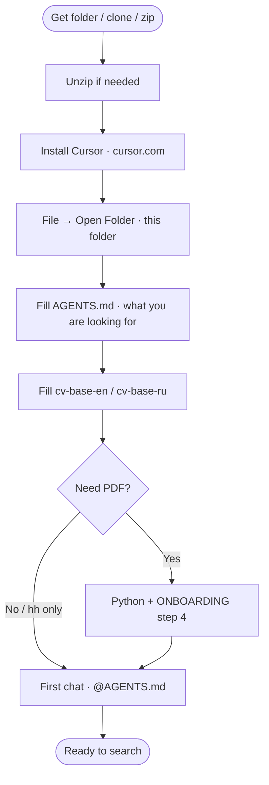
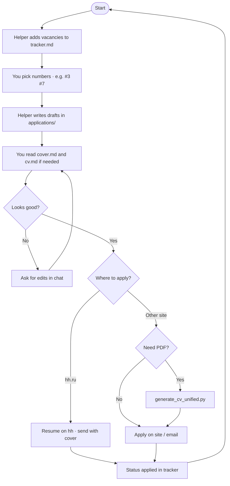
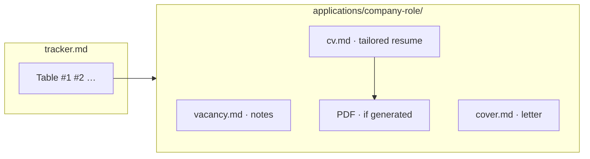
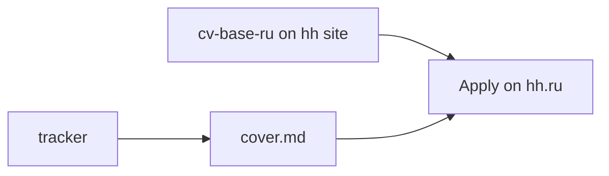

# Job Finder Kit — workflow diagrams

Mermaid blocks render in Cursor and on GitHub.

**Image for screenshots / messengers:** open [flow-diagram.svg](flow-diagram.svg) in a browser (double-click). Regenerate: `python3 generate_flow_diagram.py`

---

## 1. First-time setup (once)

---

## 2. Each application (main loop)

---

## 3. Folder layout (non-hh)

---

## 4. hh.ru — shorter path

---

More detail: [ONBOARDING.md](ONBOARDING.md) · [README.md](README.md)
