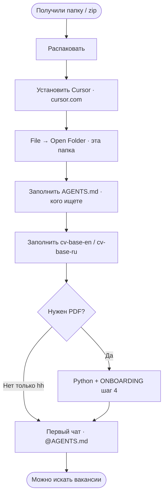
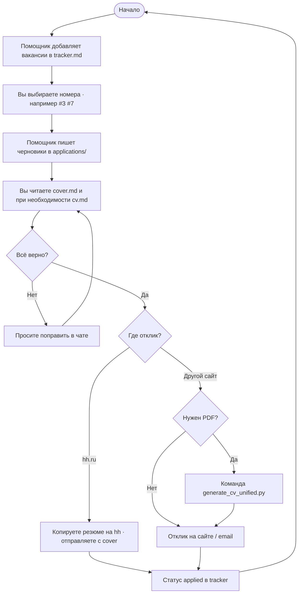
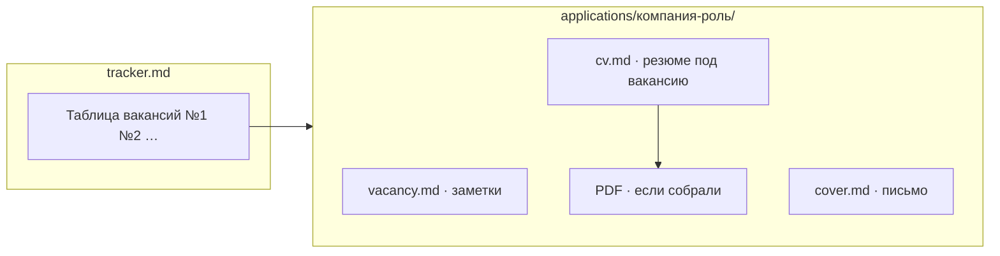
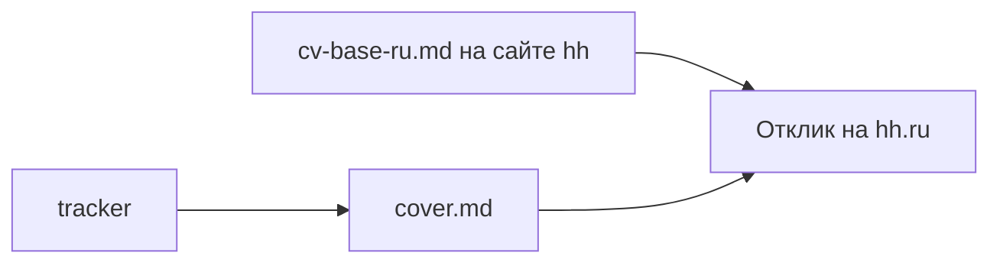

# Схема работы Job Finder Kit

Ниже — блок-схемы на русском. В Cursor и на GitHub они рисуются автоматически из текста.

**Картинка для скрина / мессенджера:** откройте [flow-diagram.svg](flow-diagram.svg) в Safari или Chrome (двойной клик). В редакторе кириллица может выглядеть как `&#1082;` — в браузере отображается нормально. Пересобрать: `python3 generate_flow_diagram.py`

---

## 1. Первый запуск (один раз)

---

## 2. Каждый отклик (основной цикл)

---

## 3. Что в какой папке (не hh)

---

## 4. hh.ru — короче

---

Подробные шаги: [ONBOARDING.md](ONBOARDING.md) · [README.ru.md](README.ru.md)
